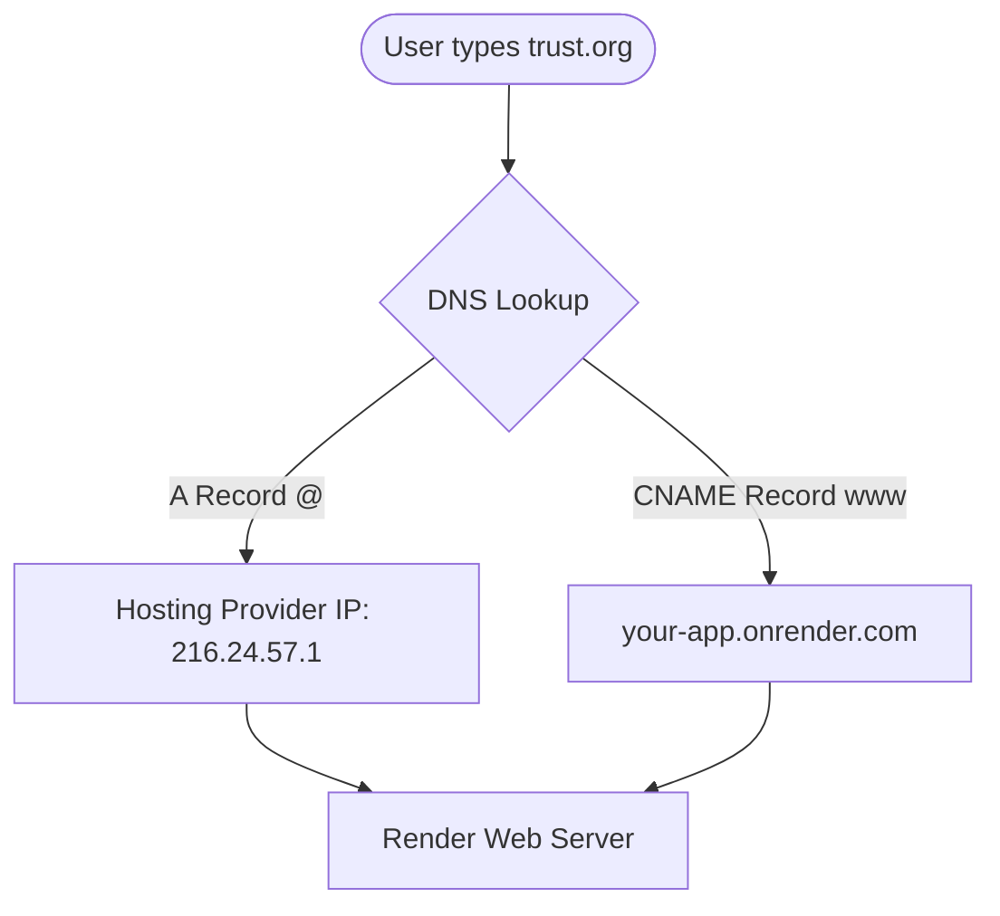

# 🚀 Deployment and Domain Configuration Guide

This guide walks you through deploying your trust website (via Streamlit or Node.js hosting) and purchasing/connecting a **custom domain** for your official web application.

---

## ☁️ Option 1: Deploying via Streamlit Community Cloud

While Streamlit is designed for Python data apps, we have created a bridge script, [app.py](file:///E:/trust_website/app.py), which bundles the HTML/CSS and base64-encoded logo to run inside Streamlit.

### How to Deploy
1. **Push your code to GitHub**:
   * Create a Git repository.
   * Commit all files (`index.html`, `developer.html`, `style.css`, `server.js`, `package.json`, `app.py`, and the `images/` directory).
   * Push the repository to your GitHub profile.
2. **Deploy to Streamlit**:
   * Go to [Streamlit Share](https://share.streamlit.io/).
   * Click **New App**.
   * Select your repository, branch (`main`), and set the main file path to `app.py`.
   * Click **Deploy!**

> [!WARNING]
> **Streamlit Limitations**: 
> * **Sandboxing**: Streamlit runs custom HTML inside an isolated `iframe`. This prevents relative navigation links (like clicking to `developer.html`) and relative backend API calls (fetching dynamic data from `server.js`) from working out-of-the-box.
> * **Custom Domains**: Streamlit Community Cloud does **not** natively support custom domains (like `www.yourtrust.org`). You would have to embed the Streamlit URL in another domain's iframe, which degrades SEO.

---

## 🌐 Option 2: The Recommended Deployment (Render or Railway)

Since your project is a complete **Express (Node.js) server**, the standard industry practice is to deploy the Node server directly. This gives you full dynamic API capabilities, lets you host images from Google Drive, and natively supports custom domains with free automatic SSL.

### How to Deploy to Render.com (100% Free Tier Available)
1. Push your repository to **GitHub**.
2. Create a free account on [Render](https://render.com/).
3. Click **New > Web Service**.
4. Link your GitHub repository.
5. Set these configurations:
   * **Runtime**: `Node`
   * **Build Command**: `npm install`
   * **Start Command**: `npm start`
6. Under **Environment Variables**, add the Google Drive keys from your `.env` file if you choose to connect Google Drive (e.g., `GOOGLE_APPLICATION_CREDENTIALS` or `GOOGLE_PRIVATE_KEY` and `GOOGLE_DRIVE_FOLDER_ID`).
7. Click **Deploy Web Service**.

---

## 🏷️ Buying a Custom Domain

To get a professional address (like `www.narayannarayani.org`), you need to buy it from a domain registrar.

### Recommended Registrars
1. **Namecheap** (Highly recommended: Cheap, user-friendly, and includes free privacy protection).
2. **Cloudflare Registrar** (Sells domains at wholesale cost with no markups; excellent for advanced DNS and security).
3. **GoDaddy** (Popular, but check renewal rates as they increase after the first year).

### Steps to Purchase
1. Go to your chosen registrar (e.g., [Namecheap.com](https://www.namecheap.com/)).
2. Search for your desired domain name (e.g., `narayannarayanitrust.org` or `narayanitrust.in`).
3. Add it to the cart and purchase. Ensure **WhoisGuard / Domain Privacy** is enabled (this is usually free and prevents spammers from getting your contact info).

---

## ⚙️ Connecting Your Domain to the Web App (DNS Setup)

Once your website is deployed (e.g., on Render at `https://trust-web.onrender.com`) and you have bought a domain (e.g., `trust.org`), configure the DNS records to link them:

### Step-by-Step DNS Configuration
1. Log in to your domain registrar (e.g., Namecheap) and click **Manage** next to your domain.
2. Go to the **Advanced DNS** or **DNS Settings** tab.
3. Add/edit the following records (replace `your-app.onrender.com` with your actual Render deployment URL):

| Type | Host | Value / Target | TTL | Purpose |
| :--- | :--- | :--- | :--- | :--- |
| **A Record** | `@` | `216.24.57.1` (Provided by Render/Vercel) | Automatic | Points the root domain (`trust.org`) to the server |
| **CNAME Record** | `www` | `your-app.onrender.com` | Automatic | Points the subdomain (`www.trust.org`) to the server |

4. Save changes. 

> [!NOTE]
> **DNS Propagation**: DNS changes can take anywhere from **5 minutes to 24 hours** to update worldwide. Most hosting providers (like Render or Vercel) will automatically generate a free SSL certificate (HTTPS) once they detect that your records are correctly pointed.
